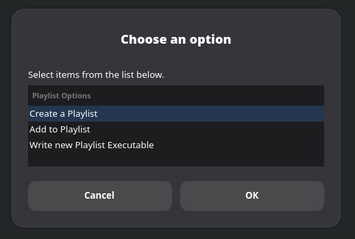
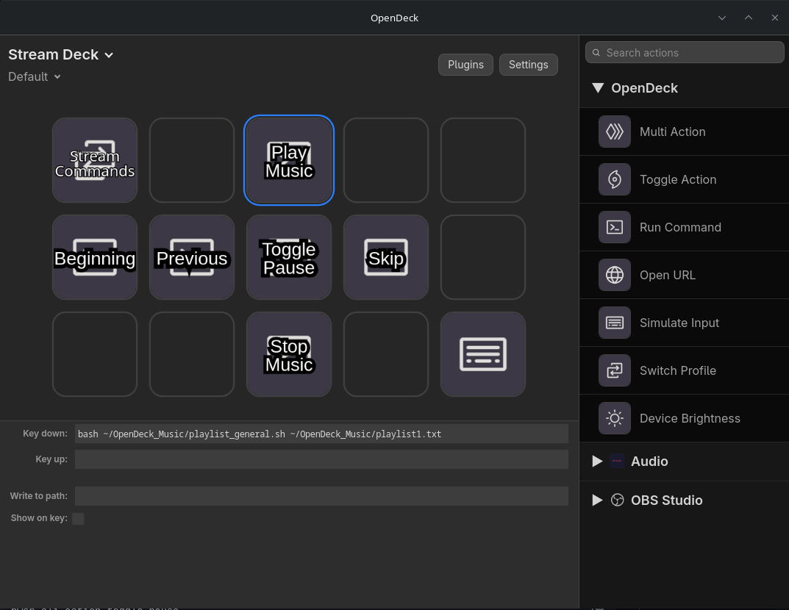

# pwsp-opendeck-playlists
This repository contains a set of scripts intended for use with OpenDeck software to play audio playlists. Currently, the Elgato software does not support Linux systems, and that includes the default audio player that can play a shuffled playlist. Using these scripts and a couple of Linux packages, you can easily set up macros on OpenDeck to play a shuffled playlist, complete with controls for pausing, skipping, etc. It accomplishes this partly by generating and reading from an iterator text file while running a simple loop with nested if statements. I recommend keeping these bash scripts all in the same directory.

I've made a video going over much of this information regarding setup and use. That video is here: https://youtu.be/hpMDuCx-FFM
## Prerequisites
These scripts were written on a CachyOS Linux system. That said, most of the commands used are simple bash commands included on any Linux device.

First, your device must be able to read bash commands and execute bash scripts.

Audio is played using Pipewire Soundpad. It may be possible to rewrite it to use something like Strawberry, but that is for future me or you to figure out. :) Make sure you can execute PWSP via the command line. The Pipewire Soundpad repository can be found here:
https://github.com/arabianq/pipewire-soundpad

There is a music playlist selector script that uses zenity. Zenity was included in my installation, but some distributions may not include it. If you are using OpenDeck, I would be shocked if your distribution doesn't include it. If you are running a distribution that doesn't include zenity and are happy with it, you are probably a better power user than I am. :)

While not required for any of these to work, I did make these specifically to have functionality in OpenDeck. The repository for OpenDeck can be found here:
https://github.com/nekename/OpenDeck

## Creating a Playlist
I recommend placing the files into a dedicated directory. Playlists are written as simple .txt files with the full directory for each audio file on each line. **Playlist_Builder.sh** was written to make creating this file easy, but you can also manually edit the .txt file as long as you get the directory location of your audio files correct. 

To execute the file **Playlist_Builder.sh**, open a terminal and run
```
bash /path/to/Playlist_Builder.sh
```
You will be given the option to create a new playlist, modify an existing playlist, or create a new hardcoded script for playing the playlist. 



For new playlists, you'll be prompted to name your playlist, and then choose which audio files will go in your playlist. You can select multiple files at once.

You will be prompted continuously to add audio files until you respond that you don't want to. Once you're done adding music, you can choose to output a hardcoded bash script for playing this playlist. I included this is as an option because it makes for a shorter final excecution line, but the included **playlist_general.sh** file can do the same thing with any arbitrary playlist file. Your playlist will be output as a .txt file with whichever name you chose. To play your playlist, run
```
bash /path/to/playlist_general.sh /path/to/your_playlist.txt
```
or
```
bash /path/to/hardcoded_playlist.sh
```
And to stop your playlist, in a separate terminal, run
```
pwsp-cli action stop && pkill -f ~/path/to/playlist_general.sh 
```
or the hardcoded playlist.

If you want to add more audio files to your playlist, you can either manually add them, or run **Playlist_Builder.sh** again and select the "Add to Playlist" option. After selecting the playlist file you'll be adding to, this will bring the add file prompts up and again loop until you decline adding more, adding to the file in place.

This is a good time to check that the playlist.sh file executes properly for you. You may have to, for example, change how pwsp-cli is called if you installed it with Flatpak. You can check this by running
```
which pwsp-cli
```
If the output is different from what is in the script that plays your playlist, replace every instance of /usr/bin/pwsp-cli with your output. You will also need to do this in the **restart_song.sh** and **previous.sh** files.

## Using with OpenDeck
### Play Music
In OpenDeck, place a "Run Command" tile in your desired position, label it whatever you like, and in the Key down line, put
```
bash /path/to/playlist_general.sh /path/to/your_playlist.sh
```
or
```
bash /path/to/hardcoded_playlist.sh
```
Substituting in for your actual directories. Pressing this key on your macropad of choice should play your playlist.



### Stop Music
To stop the music, place a Run Command tile in your desired position and have it run on Key down:
```
pwsp-cli action stop && pkill -f ~/path/to/playlist_general.sh 
```
or substitute the name of your hardcoded playlist.sh file.

### Pause
If you want a pause key, place a Run Command tile on the OpenDeck interface. Label it whatever you like and have it run the following on key down:
```
pwsp-cli action toggle-pause
```

### Skip
For a key to skip the current audio in the playlist, place a Run Command tile and in the Key down spot, type
```
pwsp-cli action stop
```

### Play Previous Audio
If you want to play the previous audio, the command is a little more complicated. Fortunately, **previous.sh** has you covered. It checks where you are in the playlist and either plays the previous audio, or restarts the first audio if you are at the beginning.

For a key to play the previous audio, place a Run Command tile on the OpenDeck interface. Label it whatever you like and have it run the following on key down:
```
bash /path/to/previous.sh
```
### Restart the current audio
Similar to playing the previous audio, **restart_song.sh** is specifically written to restart the currently playing song from the beginning. Same as playing the previous audio, place a Run Command tile on the OpenDock interface and have it run
```
bash /path/to/restart_song.sh
```
## Disabling Shuffle
Don't want the playlist to shuffle? All you have to do is change one line in the script's while loop that plays your playlist. Change this line:
```
inp=${ar3[$i]} # Set inp as variable for ease of later code lol
```
to
```
inp=${ar2[$i]} # Set inp as variable for ease of later code lol
```
This will tell the script to reference the unshuffled array instead of the shuffled one.
